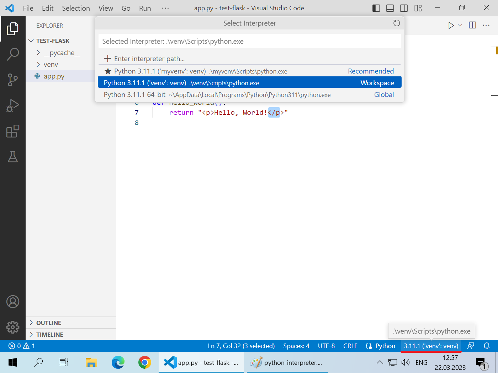
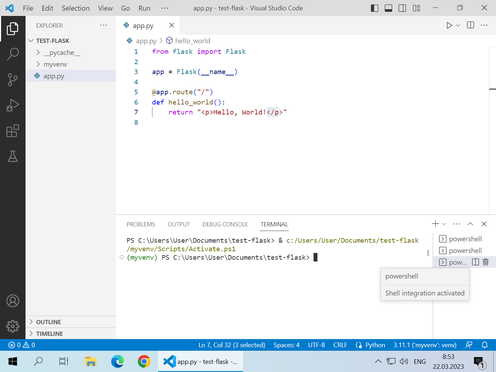
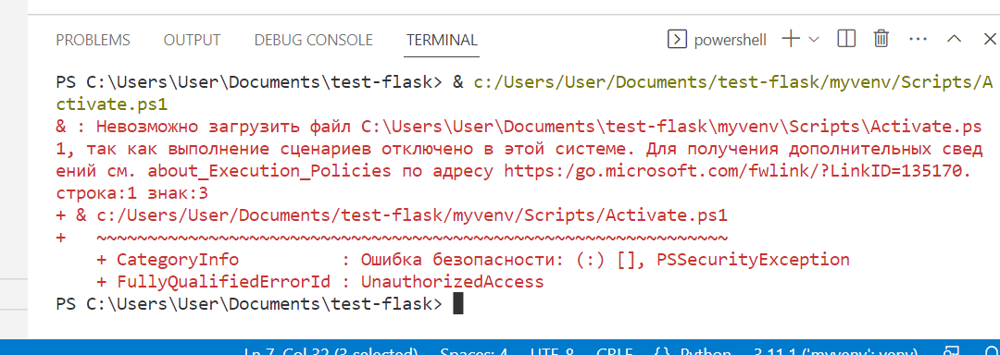

# Flask-1

## Предварительные сведения

**Виртуальное окружение** — это специальный каталог для установки программных библиотек. Используется для того, чтобы изолировать набор библиотек текущего проекта от библиотек других проектов.

**VS Code** — это текстовый редактор для программирования. Скачать его можно на [официальном сайте](https://code.visualstudio.com/download).

**Расширения VS Code** — это дополнения (плагины), которые позволяют VS Code лучше работать с языками программирования. Запустите VS Code и нажмите комбинацию клавиш `Ctrl+Shift+X`. В открывшемся слева меню найдите расширение **Python** созданное Microsoft и нажмите кнопку **Install**. Это запустит процесс установки расширения VS Code для языка Python и необходимых для него других расширений. Пока идет процесс установки вы можете продолжать работу с VS Code.

После установки расширения, при работе с кодом на Python, VS Code будет показывать в правом нижнем углу название используемого интерпретатора Python (с учетом виртуального окружения). Если VS Code выбрал неправильный интерпретатор нажмите на его название и выберите правильный интерпретатор Python.



**Терминал в VS Code**. VS Code имеет встроенный терминал. Для его открытия нужно нажать клавиши `Ctrl+Shift+~` (`~` — это тильда, клавиша в левом верхнем углу клавиатуры между `Tab` и `Escape`). Каждое нажатие этой комбинации приводит к открытию нового терминала. Переключаться между открытыми терминалами можно с помощью кнопок справа от терминала:



Чтобы завершить работу терминала нужно выполнить в нем команду `exit` или нажать кнопку с иконкой мусорного бака.

Вы также можете скрывать и отображать панель с терминалом нажимая клавиши `Ctrl+~`.

Как правило, VS Code будет использовать терминал для запуска Powershell, о чем свидетельствует аббревиатура `PS` перед текущим каталогом в системном приглашении.

**Ошибка с блокировкой запуска Powershell-скриптов**. По-умолчанию Windows блокирует запуск скриптов в Powershell что будет препятствовать активации виртуального окружения Python в нашей предстоящей работе. В этом случае, при запуске скрипта активации будет появляться такая ошибка:



Если такая ошибка появляется, то чтобы разрешить запуск скриптов в Powershell выполните следующее:

1. Закройте имеющиеся окна с Powershell
2. Запустите Powershell от имени администратора (в Windows 10 и 11 нажмите клавишу `Windows+X` и выберите соответствующий пункт)
3. Выполните команду `Set-ExecutionPolicy Unrestricted` и ответьте на вопрос `Y`
4. При желании можно проверить состояние политики запуска скриптов с помощью команды `Get-ExecutionPolicy` (ответ должен быть `Unrestricted`)

## Предварительные шаги

1. Откройте каталог проекта в редакторе VS Code (`Ctrl+K`, `Ctrl+O`).

2. Создайте *виртуальное окружение*. Для этого выполните в терминале:
```cmd
py -m venv venv
```
3. Активируйте *виртуальное окружение*. Для этого выполните в терминале:

Если у вас Powershell
```powershell
venv\scripts\activate.ps1
```

Если у вас командная строка Windows
```cmd
venv\scripts\activate.bat
```

Будем предполагать, что далее вы выполняете команды в терминале с активированным *виртуальным окружением*.

4. Установите библиотеку Flask. Для этого выполните в терминале:
```cmd
pip install flask
```

## Создание минимального приложения

1. Создайте в проекте новый файл `app.py` и добавьте в него следующий код:

```python
from flask import Flask

app = Flask(__name__)

@app.route("/")
def index_page():
    return "<p>Hello, World!</p>"
```

2. Сохраните изменения и выполните в терминале команду

```powershell
flask run
```

3. Откройте в браузере адрес [127.0.0.1:5000](http://127.0.0.1:5000) либо [localhost:5000](http://localhost:5000) и убедитесь, что в браузере отображается текстовое сообщение `Hello, World!`

4. Зафиксируйте изменения в новом коммите:

```powershell
git add .
git commit -m "Create a minimal Flask application"
```

## Добавление шаблона HTML-страницы

1. В каталоге проекта создайте подкаталог для хранения шаблонов HTML-страниц: `templates`

2. В нем создайте файл `index.html` со следующим содержанием:

```html
<!DOCTYPE html>
<html lang="ru">
<head>
    <meta charset="UTF-8">
    <meta name="viewport" content="width=device-width, initial-scale=1.0">
    <title>Проверка</title>
</head>
<body>
    <h1>Добро пожаловать!</h1>
</body>
</html>
```

3. Добавьте импорт функции `render_template` в первой строке `app.py`:

```python
from flask import Flask, render_template
```

также исправьте функцию `index_page()` следующим образом:

```python
@app.route("/")
def index_page():
    return render_template("index.html")
```

4. Сохраните все изменения, переключитесь в окно терминала с работающим сервером Flask, остановите его (для это нажмите `Ctrl+C`) и запустите вновь (снова выполните команду `flask run`)

5. Обновите страницу в браузере и убедитесь, что в браузере отображается заголовок `Добро пожаловать!`

6. Зафиксируйте изменения в новом коммите:

```powershell
git add .
git commit -m "Add a template for index page"
```

## Добавление формы ввода данных

1. В файле `index.html` внутри тега `body`, сразу после заголовка  добавьте следующие теги:

```html
<form>
    <p>
        <input type="text" name="a" value="{{a}}">
        +
        <input type="text" name="b" value="{{b}}">
        <input type="submit" value="Вычислить">
    </p>
</form>
<p>Ответ: {{answer}}</p>
```

2. В файле `app.py` добавьте в первую строку импорт переменной `request`:

```python
from flask import Flask, render_template, request
```

и исправьте функцию `index_page()`:

```python
@app.route("/")
def index_page():
    try:
        a = int(request.args["a"])
        b = int(request.args["b"])
        summa = a + b
    except:
        a, b = 0, 0
        summa = "Не удалось вычислить сумму"
    return render_template("index.html", answer=summa, a=a, b=b)
```

3. Сохраните все изменения, переключитесь в окно терминала с работающим сервером Flask, остановите его (для это нажмите `Ctrl+C`) и запустите вновь (снова выполните команду `flask run`)

4. Обновите страницу в браузере и убедитесь, что в браузере отображается форма для ввода чисел и выполняется их сложение.

5. Зафиксируйте изменения в новом коммите:

```powershell
git add .
git commit -m "Add a form to sum two numbers"
```

## Изменение метода формы ввода данных

1. В файле `index.html` измените начальный тег формы:

```html
<form method="POST">
```

2. В файле `app.py` измените функцию `index_page`():

```python
@app.route("/", methods=["GET", "POST"])
def index_page():
    try:
        a = int(request.form["a"])
        b = int(request.form["b"])
        summa = a + b
    except:
        a, b = 0, 0
        summa = "Не удалось вычислить сумму"
    return render_template("index.html", answer=summa, a=a, b=b)
```

3. Сохраните все изменения, переключитесь в окно терминала с работающим сервером Flask, остановите его (для это нажмите `Ctrl+C`) и запустите вновь (снова выполните команду `flask run`)

4. Обновите страницу в браузере и убедитесь, что в браузере отображается форма для ввода чисел и выполняется их сложение.

5. Откройте файл `readme.md` и запишите в нем ответ на контрольный вопрос:

> Что изменилось в работе сайта при использовании метода POST?

6. Зафиксируйте изменения в новом коммите:

```powershell
git add .
git commit -m "Change the form method to POST"
```
